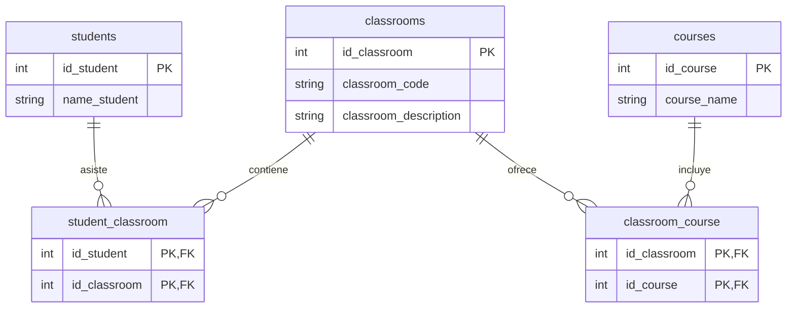

# Ejercicio---Normalizacion de Bases de Datos

## Tablas normalizadas

https://docs.google.com/spreadsheets/d/1uOAgw3A31Yyi5_l0Danste3LpwQ693TetADzrp6VTV0/edit?gid=0#gid=0

## Diagrama de Chen

## Diagrama de patas de gallo

