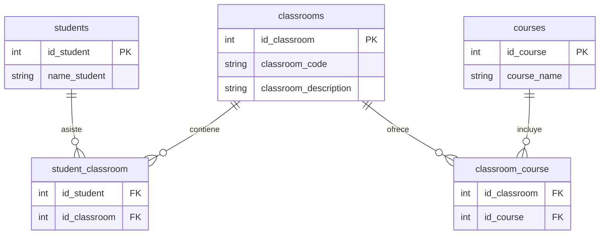

# Ejercicio---Normalizacion-de-Bases-de-Datos

```mermaid
erDiagram
    students {
        int id_student PK
        string name_student
    }

    courses {
        int id_course PK
        string course_name
    }

    classrooms {
        int id_classroom PK
        string classroom_code
        string classroom_description
    }

    student_classroom {
        int id_student FK
        int id_classroom FK
    }

    classroom_course {
        int id_classroom FK
        int id_course FK
    }

    students ||--o{ student_classroom : "asiste"
    classrooms ||--o{ student_classroom : "contiene"
    classrooms ||--o{ classroom_course : "ofrece"
    courses ||--o{ classroom_course : "incluye"
```
